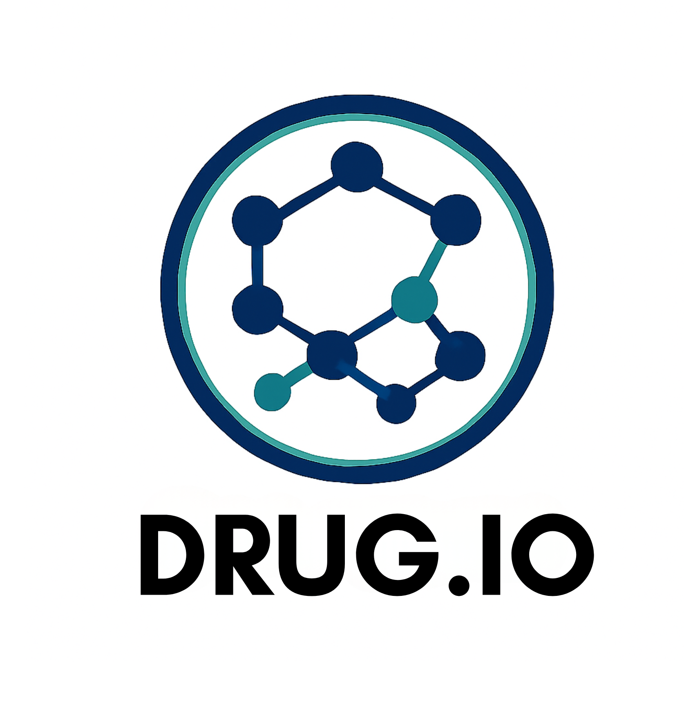

<p align="center">
  
</p>
Project repository collected research and tooling for drug property prediction, drug-target interaction, and drug combination experiments. This workspace contains multiple related projects and example apps used for model training, inference, and small web demos.

Contents
- `AI Drug/` — deep-learning model and web app for drug-target interaction (DTI) prediction.
- `Drug-Combination-Prediction-main/` — code and data for predicting drug combinations using GNN models.
- `Drug.io-main/` — utilities, datasets, and example scripts for ADMET prediction and helper tooling.
- `Model_predictions/`, `Model_training/` — organized model inputs/outputs by ADMET category.

This README provides a high-level overview and step-by-step instructions to run, train, and use the main projects in this workspace.

Prerequisites
- Python 3.8+ (3.10 recommended)
- Git
- CUDA (optional) for GPU training
- Recommended: create a virtual environment per project

Quick start — AI Drug web demo

1. Open a terminal and change to the `AI Drug` folder:

   ```powershell
   cd "AI Drug"
   ```

2. Create and activate a virtual environment (Windows example):

   ```powershell
   python -m venv .venv
   .\.venv\Scripts\Activate.ps1
   pip install --upgrade pip
   pip install -r requirements.txt
   ```

3. Run the demo app:

   ```powershell
   python app.py
   ```

4. Open a browser at `http://localhost:5000` (or the address shown in the console).

Notes for `AI Drug` project
- `train_model.py` — training entrypoint for model experiments. Edit `model_config.json` in `models/` to change hyperparameters.
- `predict.py` and `app.py` — inference code used by the web demo.
- Trained model checkpoint: `models/best_model.pt`.

Drug-Combination-Prediction-main

1. Change into the folder and install dependencies:

   ```powershell
   cd "Drug-Combination-Prediction-main"
   python -m venv .venv
   .\.venv\Scripts\Activate.ps1
   pip install --upgrade pip
   pip install -r requirements.txt
   ```

2. Use the provided `final_gnn_model.pt` for inference or open the notebooks under `notebooks/` to reproduce preprocessing and training experiments.

Drug.io-main

This folder contains utilities, ADMET datasets, and example scripts.

1. Install dependencies and run examples:

   ```powershell
   cd "Drug.io-main/BackEnd"
   python -m venv .venv
   .\.venv\Scripts\Activate.ps1
   pip install --upgrade pip
   pip install -r requirements.txt
   python app.py
   ```

2. The `admet_data/` subfolders contain curated datasets used to train separate models for absorption, distribution, metabolism, excretion, and toxicity.

Running training and evaluation (general guidance)
- Inspect the project-specific `requirements.txt` before installing to avoid conflicts.
- Use the provided notebooks to reproduce preprocessing and training steps where available.
- For custom experiments, adapt dataset paths in the training scripts and set the output directory under `Model_training/`.

Repository maintenance and GitHub push
- This repository can be pushed to a remote GitHub repository. Ensure you have a configured Git user and authentication (SSH key or credential helper).

License & attribution
- No license file is included. Add a `LICENSE` if you plan to open-source the code.

Contact / Next steps
- If you want, I can: commit this README update, add a `LICENSE`, and push the repository to `https://github.com/Harshitha-MG17/DRUG.IO.git`. Ask me to proceed and provide any preferred license.
